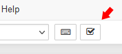

Action Tracking
==============

This extension tracks several user statistics and sends them to a server while interacting with Jupyter notebooks.

### Usage

Tracking will only occur when the user has given their consent via the checkbox in the parameters.
Tracking status is represented as a checkbox in the notebook toolbar as seen below.

If the user wishes to disable tracking temporarily they can uncheck this box. This disables the tracking until the box is checked again, another notebook is opened or this notebook is reopened.

If the users wishes to disable tracking permanently they can either revoke their consent via the checkbox in the parameters or disable the extension altogether.

### Tracking includes:
- Time spent on notebook
- Amount of clicks
- Created and deleted cells
- Copy and Pastes
- Cell executions and errors
- Key presses
- Mouse movement
- Scrolling
- A copy of the notebook itself